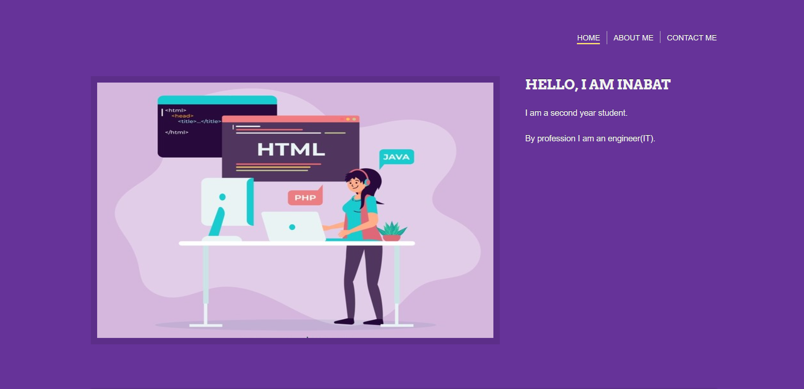
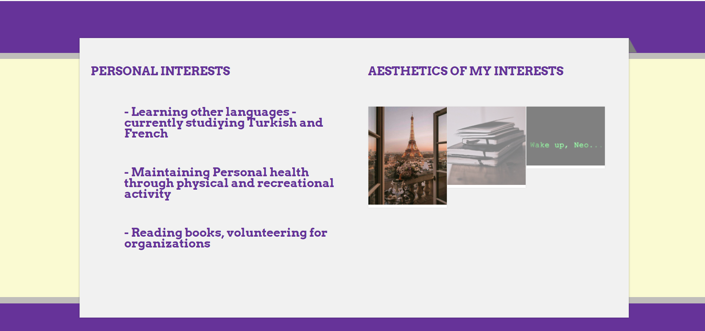
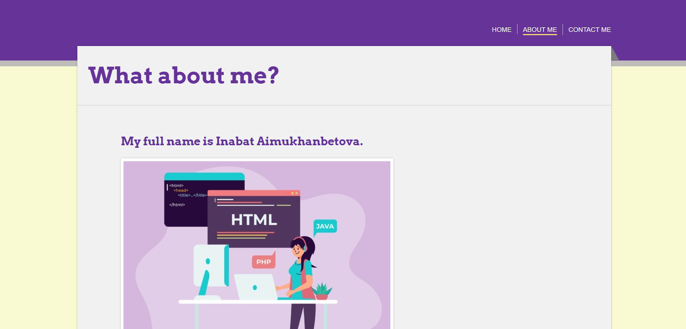
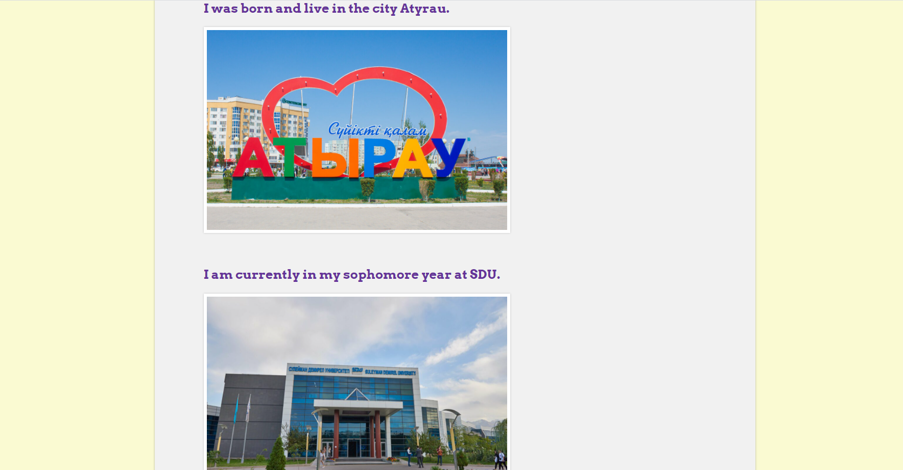
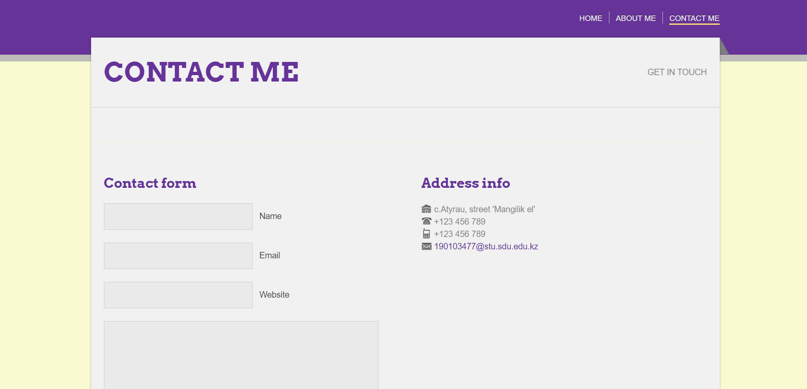

## Table of contents

-   [About me](#about-me)
-   [Portfolio](#screenshots)
-   [Personal interests](#interests)
-   [Academic goals for 2021](#inspiration)
-   [Contact](#contact)

## Who am I?

My name is Inabat (19y.o). I am a second year student. By profession I am an engineer(IT).

## Here the screenshots from my portfolio website

## Personal Interests

-   Learning other languages - currently studiying Turkish and French
-   Maintaining Personal health through physical and recreational activity
-   Reading books, volunteering for organizations

## Academic goals for 2021

-   _Attain_ _a_ _cumulative_ _GPA_ _of_ _3.5_ _or_ _higher_ _in_ _this_ _academic_ _year._
-   _Improve_ _public_ _speaking_ _and_ _presentation_ _skills_
-   _Have_ _a_ _good_ _balance_ _university,_ _work,_ _sport,_ _and_ _social_ _life_ _(but_ _quarantine . .)._
